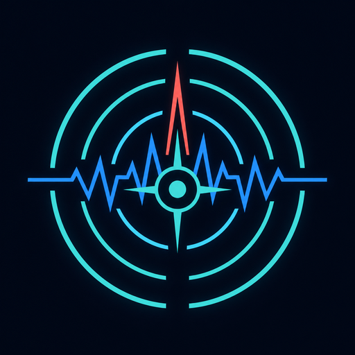

# GeoVibe

  

<strong>Monitoreo táctico de vibraciones, respuesta de seguridad y Red de Alerta Temprana.</strong>

  <a href="https://github.com/HUEVOMAN77/GeoVibe/releases/latest/download/GeoVibe.apk"><strong>Descargar GeoVibe para Android</strong></a>
  &nbsp;·&nbsp;
  <a href="https://github.com/HUEVOMAN77/GeoVibe/releases">Ver versiones</a>

> **Estado del proyecto:** Primera fase funcional. GeoVibe presenta una base operativa, ordenada y preparada para evolucionar, con funciones de monitorización, respuesta ante eventos y comunicación de seguridad integradas en una experiencia única.

## Propósito

GeoVibe ayuda a observar vibraciones y retumbos desde el acelerómetro del teléfono, mantener un registro de actividad reciente y activar un protocolo visual, sonoro y de comunicación cuando detecta un patrón de fuerza sostenido. Su interfaz está orientada a una lectura rápida: estado del monitor, fuerza en tiempo real, actividad reciente y acciones de seguridad están agrupadas para que la información relevante sea accesible durante una situación de tensión.

La aplicación también incorpora la **Red EEW**, un espacio colaborativo que muestra alertas sísmicas registradas por la red sobre un mapa de El Salvador. Cuando llega una señal de evacuación, GeoVibe muestra la alerta, activa el protocolo de alarma y ofrece acciones inmediatas de resguardo y comunicación.

## Funciones principales

| Área | Funcionamiento |
|---|---|
| **Monitor de vibración** | Muestra la fuerza de aceleración en tiempo real y permite activar o detener el monitoreo desde la pantalla principal. Mientras está activo, conserva una notificación de estado para indicar que la escucha continúa en segundo plano. |
| **Detección de eventos** | Calcula la fuerza neta del movimiento del teléfono, descuenta la gravedad y confirma una alerta cuando la fuerza supera el umbral configurado de forma sostenida. El valor predeterminado es **5.0 m/s²**, con confirmación después de **200 ms** y al menos tres lecturas consecutivas. |
| **Alarma de emergencia** | Ante una detección confirmada, reproduce un tono prioritario, activa vibración, muestra un aviso visual en pantalla y genera una notificación de alarma. El protocolo se detiene automáticamente tras **10 segundos** o antes al pulsar **Silenciar alarma ahora**. |
| **Estoy a Salvo** | Después de una alerta local, o desde una alerta EEW, presenta un mensaje de seguridad listo para compartir. Incluye una ubicación aproximada mediante enlace de mapa cuando el dispositivo puede obtenerla. |
| **Compartición de estado** | Abre WhatsApp directamente si está instalado. Para Facebook/Messenger intenta primero Messenger, después Facebook y finalmente el selector de Android. También abre el compositor SMS nativo con el mensaje preparado. |
| **Guía de Supervivencia** | Incluye contenido local para consultar sin internet, organizado en las etapas **Antes**, **Durante** y **Después** de un sismo. |
| **Red EEW** | Muestra un mapa centrado en El Salvador, alertas comunitarias, epicentros rojos pulsantes, selección de marcadores, filtros por departamento y tarjetas con ubicación, profundidad, aceleración y hora. |
| **Historial** | Presenta los últimos eventos disponibles para esa instalación. Una instalación nueva comienza con el historial vacío para no mezclar datos de prueba o actividad anterior. |
| **Salud del monitor** | Expone el nivel de batería, estado de ahorro de energía y frescura de las lecturas, para identificar si el sistema ha limitado la monitorización en segundo plano. |

## Flujo de detección y respuesta

El flujo comienza cuando la persona activa el sensor. GeoVibe observa continuamente la aceleración de los ejes X, Y y Z y calcula la intensidad neta del movimiento. Una lectura aislada que cae de inmediato por debajo del umbral reinicia la confirmación, mientras que una vibración breve pero sostenida puede activar el evento.

| Etapa | Comportamiento de GeoVibe |
|---|---|
| **1. Observación** | El Monitor muestra la fuerza actual y mantiene la escucha activa mientras Android permite la ejecución del servicio. |
| **2. Confirmación** | La fuerza neta debe superar el umbral elegido durante 200 ms y acumular al menos tres lecturas consecutivas. Esto evita responder a un único pico instantáneo. |
| **3. Alerta** | Se activa la alarma, la vibración, el aviso en pantalla y la notificación de emergencia. El usuario puede silenciar el protocolo desde Monitor. |
| **4. Registro** | El evento guarda su fecha, pico de vibración y ubicación aproximada cuando está disponible. Después aparece en el historial correspondiente. |
| **5. Comunicación** | El botón **Estoy a Salvo** prepara un texto para informar a contactos por WhatsApp, Facebook/Messenger o SMS. |

## Protocolo de alarma y visibilidad

GeoVibe usa un canal de alarma de prioridad máxima, categoría de alarma y solicitud de pantalla completa para dar la mayor visibilidad permitida por Android. También conserva los controles de pantalla activa durante el evento para que la alerta pueda mostrarse en la pantalla de bloqueo según la política del fabricante.

> **Importante:** Android mantiene la decisión final sobre el modo No Molestar, el volumen, la ejecución en segundo plano y la pantalla completa. Para permitir la omisión de No Molestar, la persona usuaria debe habilitar explícitamente el acceso de GeoVibe en **Ajustes → Alertas críticas**. Las notificaciones y la ubicación también requieren permisos concedidos desde Android.

## Red EEW: alertas colaborativas

La pestaña **Red EEW** proporciona una lectura geográfica de las alertas comunitarias. El mapa permanece centrado en El Salvador para ofrecer una referencia territorial directa. Cada marcador puede seleccionarse para consultar los datos asociados y los filtros reducen la vista al departamento elegido.

| Elemento | Información visible |
|---|---|
| Marcador de epicentro | Pulso rojo animado sobre la posición recibida de la alerta. |
| Tarjeta de detalle | Departamento o ubicación, profundidad, aceleración estimada y hora del reporte. |
| Filtros | Selección por departamento para concentrar la vista de eventos. |
| Señal de evacuación | Aviso visual prioritario con sonido, vibración, apagado automático de 10 segundos y opción de silenciar. |

El mapa requiere conectividad para cargar sus teselas cartográficas. La guía de supervivencia, la interfaz de alarma y el mensaje de estado seguro permanecen disponibles dentro de la aplicación, aunque la red no esté disponible.

## Estoy a Salvo y comunicación de emergencia

El mensaje preparado comunica que los sensores se activaron y que la persona se encuentra a salvo. Cuando la ubicación está disponible, incluye un enlace de mapa con coordenadas aproximadas; cuando no lo está, mantiene el mensaje y señala claramente que la ubicación no pudo obtenerse. Esta alternativa permite conservar la acción de comunicación aun si no hay GPS, permiso o señal de ubicación.

| Canal | Resultado esperado |
|---|---|
| **WhatsApp** | Abre la aplicación con el texto preparado cuando está instalada. |
| **Messenger / Facebook** | Prioriza Messenger, luego Facebook y, si ninguno está instalado, muestra el selector de aplicaciones Android. |
| **SMS** | Abre la aplicación de mensajes predeterminada con el texto listo para enviar. |

La selección de destinatarios y el envío final pertenecen siempre a la persona usuaria dentro de la aplicación de mensajería elegida. La disponibilidad de cada canal depende de que exista una aplicación compatible en el dispositivo.

## Guía de Supervivencia disponible sin conexión

La guía está incluida dentro de GeoVibe y se consulta desde Ajustes. Su contenido se divide en tres momentos prácticos: preparación de una mochila y zonas seguras **antes** del sismo; la regla de agacharse, cubrirse y agarrarse **durante** el movimiento; y la verificación de daños, la consulta de fuentes oficiales y el uso de **Estoy a Salvo** **después** del evento.

## Experiencia de uso

La primera apertura muestra un intro de cinco segundos con el logotipo GeoVibe y, a continuación, una bienvenida centrada en El Salvador con un tutorial guiado. El tutorial explica el monitor, la ubicación aproximada y la Red EEW. Tras completarlo, las aperturas posteriores pasan del intro directamente al dashboard.

La interfaz utiliza una estética de dashboard táctico oscuro para diferenciar los estados del sensor, las alertas y las acciones de seguridad. Las funciones principales se organizan en Monitor, Historial, Red EEW, Ajustes y Acerca de.

## Alcance de la primera fase

Esta primera fase concentra las capacidades esenciales de monitoreo móvil, alerta local, red colaborativa, orientación offline y comunicación de estado. La estructura separa los flujos de detección, alerta, mensajes, registro y presentación para facilitar la evolución del proyecto sin desordenar las funciones ya operativas.

GeoVibe es una herramienta de apoyo y conciencia situacional. No sustituye a los avisos, planes de evacuación ni instrucciones de Protección Civil, autoridades locales o servicios de emergencia. La detección depende de los sensores, permisos, estado de batería, ajustes del fabricante y contexto físico del teléfono; por ello, una alerta de GeoVibe no constituye una certificación oficial de actividad sísmica.

## Validación de la versión

La versión publicada fue sometida a análisis estático, pruebas automatizadas del motor de detección, los datos de alertas, la duración de alarma y el formato del mensaje de seguridad. La APK se verificó como paquete Android válido para `com.geovibe.geovibe`, versión `1.0.0`, con compatibilidad desde Android 7.0 (API 24).

Las funciones que dependen de aplicaciones externas, permisos del dispositivo, señal de ubicación, políticas de batería, pantalla bloqueada y ajustes de No Molestar deben confirmarse en cada teléfono Android donde vaya a utilizarse.

## Créditos

**GeoVibe** es una aplicación independiente desarrollada por **HUEVOMAN77**. El proyecto mantiene una visión profesional de monitoreo móvil, comunicación de seguridad y visualización colaborativa de alertas.

| Concepto | Información |
|---|---|
| Autor y titular del proyecto | HUEVOMAN77 |
| Proyecto | GeoVibe |
| Estado | Primera fase funcional |
| Plataforma | Android |
| Repositorio | [github.com/HUEVOMAN77/GeoVibe](https://github.com/HUEVOMAN77/GeoVibe) |

## Derechos de autor

Copyright © 2026 **HUEVOMAN77**. Todos los derechos reservados.

El código, identidad visual, documentación y materiales propios de GeoVibe están protegidos por las normas de derecho de autor aplicables. No se concede autorización para copiar, redistribuir, modificar, comercializar o publicar derivados sin permiso previo y escrito del titular. Los componentes de terceros conservan sus respectivos avisos y licencias. Consulta [LICENSE](LICENSE) para el aviso completo.

